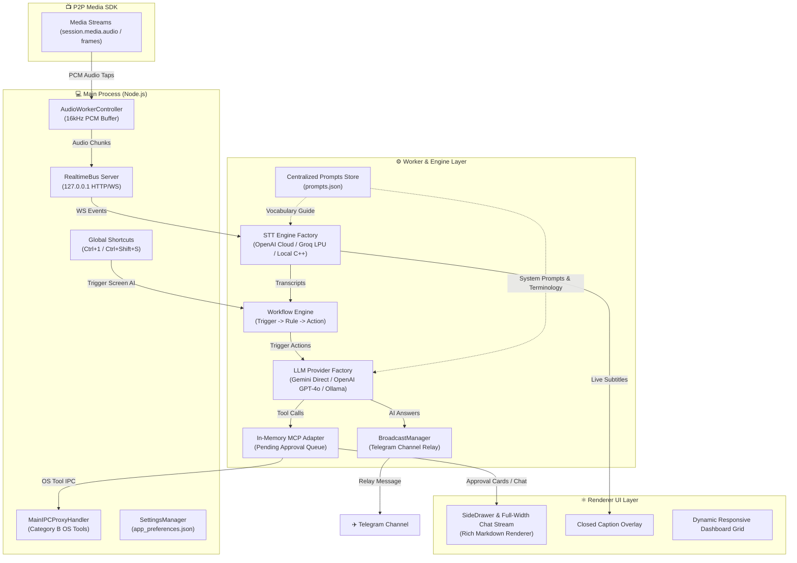

# 📄 Functional Requirements Document (FRD)
## Live AI Interview Copilot & P2P Media Assistant Platform `v1.0.0`

---

## 🎯 1. Product Vision & Executive Summary

The **Live AI Interview Copilot & P2P Media Platform** transforms real-time screen sharing and audio streaming into an intelligent, interactive pairing assistant. Built on top of a high-performance **P2P WebRTC Media SDK**, the platform continuously taps live microphone/speaker PCM audio streams, transcribes dialogue via modular STT providers (OpenAI Cloud, Groq LPU, Local C++), evaluates event-driven workflows, and delivers inline AI Copilot guidance, tool approvals, and auto-summaries directly inside the application's chat interface.

---

## 🏗️ 2. High-Level Architecture Overview



---

## 🔬 3. Core Subsystems & Functional Requirements

### FR-1: Shared Architectural Foundation (`src/shared`)
* **FR-1.1**: Service Container (`Container.ts`) supporting singleton instance registration and resolution.
* **FR-1.2**: Strongly-typed Event Bus (`EventBus.ts`) publishing and delivering system events (`transcript.final`, `chat_received`, `tool_pending_approval`, `tool_approved`, `ai.trigger_screen_analysis`, `transcript.clear`).
* **FR-1.3**: 15 Zod-validated Model Context Protocol (MCP) Tool definitions with Category A worker-local and Category B IPC-proxied OS tool categorizations.

---

### FR-2: Modular AI Engine & Provider Registries (`src/agent/ai`)
* **FR-2.1 (`ILLMProvider`)**: Decoupled interface contract (`complete(messages: LLMMessage[])`) implemented by all LLM engines.
* **FR-2.2 (`LLMProviderFactory`)**:
  * Extensible factory and registry managing `gemini-direct`, `openai`, `ollama`, and `antigravity`.
  * Support for zero-code `.env` provider selection (`LLM_PROVIDER=openai` or `LLM_PROVIDER=gemini`).
* **FR-2.3 (Google Gemini Direct Provider)**: Direct REST API integration with `gemini-flash-lite-latest` and `gemini-3.5-flash` supporting native `inlineData` base64 vision images.
* **FR-2.4 (OpenAI GPT-4o Provider)**: Chat Completions REST provider supporting OpenAI multimodal vision (`image_url`).

---

### FR-3: Instant System-Wide Hotkeys & Active Language Detection
* **FR-3.1 (`Ctrl + 1` / `Cmd + 1` Hotkey)**: System-wide global shortcut (`globalShortcut`) triggering active screen JPEG capture and evaluating Quiz / MCQ or LeetCode coding questions.
* **FR-3.2 (`Ctrl + Shift + S` / `Cmd + Shift + S` Hotkey)**: System-wide global shortcut triggering active screen JPEG capture and executing surgical code debugging.
* **FR-3.3 (Active Coding Language Auto-Detection)**: Inspects the active language selector in the host editor header (`JavaScript`, `Python3`, `C++`, `Java`, `TypeScript`) or template signature, and outputs solutions strictly in that language.
* **FR-3.4 (Intent Classifier Bypass for Hotkeys)**: Hotkey triggers bypass the intent classifier completely (`forceScreenContext: true`), ensuring 100% guaranteed screenshot capture with zero false-negative skipping.

---

### FR-4: Fast-Paced Interview Bullet-Point Formatting (`prompts.json`)
* **FR-4.1 (Short Bullet Pointers Only)**: Strict prompt instruction prohibiting walls of text or dense paragraphs. All explanations must be rendered as punchy 1-2 line bullet points.
* **FR-4.2 (Bold Lead-in Keywords)**: Every bullet point starts with a bold category lead-in (`**Core Concept**:`, `**Time Complexity**:`, `**Space Complexity**:`) for 2-second visual scanning during live interviews.
* **FR-4.3 (Single Source Prompt Store)**: Single point of truth in `prompts.json` for `intentClassifier` and `technicalAssistant` system prompts and `technicalDictionary` array (50+ terms across AI/LLM/RAG, Python, Node.js, and React).

---

### FR-5: Pattern-Based Broadcaster Framework & Telegram Channel Relay (`src/agent/broadcast`)
* **FR-5.1 (`IBroadcastProvider`)**: Observer/Adapter interface contract (`broadcast(payload: BroadcastMessagePayload)`) for fan-out messaging services.
* **FR-5.2 (`BroadcastManager`)**: Observer manager coordinating multiple broadcast providers.
* **FR-5.3 (`TelegramBroadcastProvider`)**: Concrete Telegram Bot API broadcast provider sending real-time AI answers to designated Telegram channels or chat groups.

---

### FR-6: Multi-Turn Conversation Memory & Token Scoping
* **FR-6.1 (Stateful Memory Window)**: Retains up to 10 previous Q&A turns (20 messages max) in `AgenticWhisperQuestionHandler` to support natural follow-up questions (*"How does it scale?"*, *"Compare it to Memcached"*).
* **FR-6.2 (Token & RAM Protection)**: Past conversation turns store concise text Q&A pairs only. Heavy base64 screen images and large clipboard text dumps are omitted from past turns.
* **FR-6.3 (Context Scoping & Keyword Enforcement)**:
  * Clipboard text is read ONLY when user intent explicitly requires clipboard context (`needsClipboardContext: true`), capped at 2,000 characters.
  * Active screen screenshots are captured whenever user intent requires visual screen context or when speech mentions screen keywords (`screen`, `view`, `solve`, `problem`, `code`, `error`, `fix`).

---

### FR-7: Voice Activity Detection (VAD) & Diagnostic Metrics (`src/agent/transcription`)
* **FR-7.1 (`ITranscriptionProvider`)**: Decoupled Speech-to-Text interface contract (`start()`, `transcribeChunk()`, `stop()`, `onTranscript()`).
* **FR-7.2 (`TranscriptionProviderFactory`)**: Registry managing `openai-cloud`, `groq-cloud` (Sub-100ms LPU acceleration), and `local-whisper`.
* **FR-7.3 (VAD Level Metrics Logging)**: Real-time logging of `Peak RMS`, `Trigger RMS`, `NoiseFloor`, and `Dynamic Threshold` on speech events.
* **FR-7.4 (Enhanced Noise Immunity)**: Base threshold set to 300 with dynamic threshold `Math.max(300, NoiseFloor * 2.2)`, eliminating ambient room noise triggers.

---

### FR-8: Rich Markdown Chat UI & Dynamic Screen Layout (`src/renderer`)
* **FR-8.1 (Rich Markdown Rendering)**: Custom React Markdown renderer formatting code blocks with IDE containers and language headers (````javascript ... ````), inline code pills (`code`), bold text, and bullet lists.
* **FR-8.2 (Dynamic Screen Spreading)**:
  * **Active AI Mode**: Chat UI automatically expands to **100% full screen width** at the top (`max-width: 1100px`), with control cards (`AiAssistantCard`, `HostCard`, `ViewerCard`) stacked below it.
  * **Stopped AI Mode**: Chat UI automatically **reverts back to compact previous width** (340px sidebar layout).

---

### FR-9: P2P Media & WebRTC SDK (`src/sdk`)
* **FR-9.1 (Session Code Security)**: Base36 8-character session codes (`a7k9-x2p4`) with $36^8$ entropy ($2.82 \times 10^{12}$ combinations).
* **FR-9.2 (E2EE WebRTC Pipeline)**: Peer-to-peer audio/video streaming via DTLS-SRTP.
* **FR-9.3 (Auto Cascade Signaling)**: Dynamic probing cascade across Firebase Realtime DB, WebSocket Server, WebTorrent Tracker Mesh, and Electron IPC Loopback.

---

## 🛠️ 4. Non-Functional Requirements (NFR)

* **NFR-1 (Latency)**: Sub-second response latency (~500ms – 1.2s) for live voice question processing.
* **NFR-2 (Memory Footprint)**: RAM consumption under 250MB during active screen share and audio transcription.
* **NFR-3 (Extensibility)**: New LLM providers, STT engines, or Broadcast providers can be added by implementing `ILLMProvider`, `ITranscriptionProvider`, or `IBroadcastProvider` in under 30 lines of code.
* **NFR-4 (Security)**: Category B OS tools with destructive or state-modifying actions execute through the MCP Adapter Security Gatekeeper with user approval queues.
