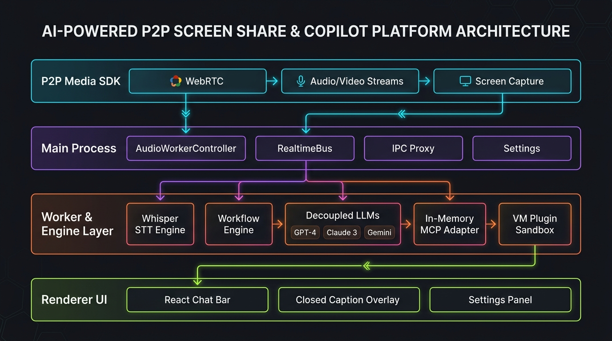
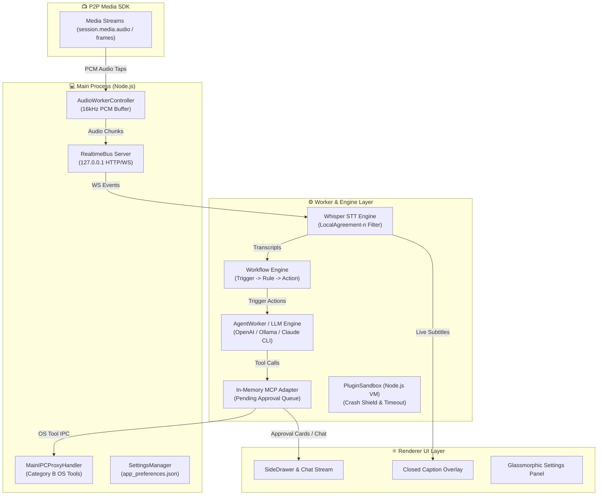
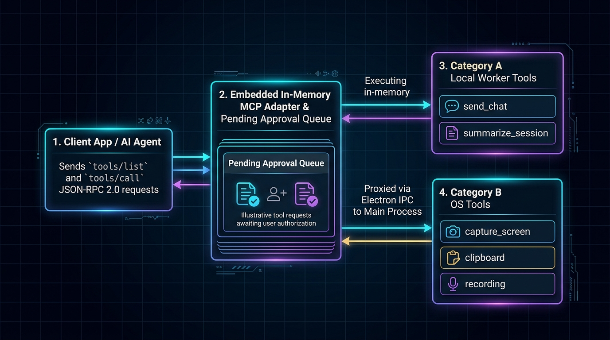
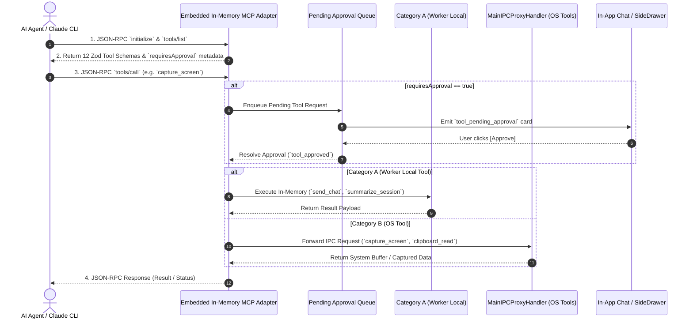

# 📄 Functional Requirements Document (FRD)
## Live AI Interview Copilot & P2P Media Assistant Platform `v1.0.0`

---

## 🎯 1. Product Vision & Executive Summary

The **Live AI Interview Copilot & P2P Media Platform** transforms real-time screen sharing and audio streaming into an intelligent, interactive pairing assistant. Built on top of a high-performance **P2P WebRTC Media SDK**, the platform continuously taps live microphone/speaker PCM audio streams, transcribes dialogue locally or via cloud STT providers, evaluates event-driven workflows, and delivers inline AI Copilot guidance, tool approvals, and auto-summaries directly inside the application's chat interface.

---

## 🏗️ 2. High-Level Architecture Overview

---

### 🔌 Model Context Protocol (MCP) Execution Flow

---

## 🔬 3. Core Subsystems & Functional Requirements

### FR-1: Shared Architectural Foundation (`src/shared`)
* **FR-1.1**: Lightweight, zero-dependency Map-based Service Container (`Container.ts`) supporting singleton instance registration and resolution.
* **FR-1.2**: Strongly-typed Event Bus (`EventBus.ts`) publishing and delivering synchronous/asynchronous system events (`transcript.final`, `chat_received`, `tool_pending_approval`, `tool_approved`, `tool_dismissed`).
* **FR-1.3**: 12 Zod-validated Model Context Protocol (MCP) Tool definitions with `requiresApproval` metadata.

### FR-2: Realtime Bus & Audio Worker Pipeline (`src/realtime`, `src/workers`)
* **FR-2.1**: 1MB PCM `RingBuffer` with drop-oldest backpressure overflow management.
* **FR-2.2**: Embedded `RealtimeBus` WebSocket/HTTP server listening exclusively on loopback interface (`127.0.0.1`) with session token authentication.
* **FR-2.3**: `AudioWorkerController` tapping 16kHz 16-bit mono PCM audio frames and streaming them to the RingBuffer.

### FR-3: Speech-to-Text (STT) Engine & Transcript Stabilization (`src/agent/transcription`, `src/renderer/utils`)
* **FR-3.1**: Local native `whisper.cpp` STT execution using bundled `whisper-cli.exe` and `ggml-tiny.en.bin` model files (~2ms execution time per chunk).
* **FR-3.2**: Cloud `OpenAIAudioTranscriptionProvider` REST API calling `https://api.openai.com/v1/audio/transcriptions`.
* **FR-3.3**: `LocalAgreement-n` filter emitting unconfirmed `transcript.partial` immediately and confirmed `transcript.final` when consecutive segments match.
* **FR-3.4**: Dynamic `createTranscriptionProvider()` factory resolving configuration from `SettingsManager`.
* **FR-3.5**: WebAudio `AudioStreamer` capturing 16kHz 16-bit mono PCM audio chunks from microphone or speaker media tracks and dispatching via `sendAudioChunk` IPC.
* **FR-3.6**: Main process IPC listener (`AUDIO_CHUNK`) routing audio buffers into `AudioWorkerController` and broadcasting Whisper transcripts back to renderer windows (`TRANSCRIPT_EVENT`).

### FR-4: Decoupled LLM Architecture & Workflow Engine (`src/agent/ai`, `src/workflow`)
* **FR-4.1**: Decoupled `ILLMProvider` engine supporting `OpenAIProvider` (GPT), `OllamaProvider` (`http://localhost:11434`), and `ClaudeCLIProvider` (System CLI subprocess).
* **FR-4.2**: Declarative `WorkflowEngine` matching incoming triggers against rules and actions.
* **FR-4.3**: Automatic routing of sensitive tool calls (`requiresApproval: true`) to the Pending Approval Queue.

### FR-5: Embedded In-Memory MCP Adapter (`src/agent/mcp`)
* **FR-5.1**: JSON-RPC 2.0 protocol support (`initialize`, `tools/list`, `tools/call`).
* **FR-5.2**: Categorization of tools into Category A (Worker Local) and Category B (Main-Process IPC Proxied OS Tools).
* **FR-5.3**: Pending Approval Queue managing user authorization states (`tool_approved` / `tool_dismissed`).

### FR-6: Isolated Plugin System Architecture (`src/plugin`)
* **FR-6.1**: Isolated execution sandbox built on Node.js `node:vm` hiding raw system modules (`fs`, `child_process`, `net`).
* **FR-6.2**: Per-Plugin Crash Shield (`try/catch` wrapper) preventing faulty plugin code from crashing host process.
* **FR-6.3**: Strict execution timeout enforcement (100ms infinite loop cutoff).
* **FR-6.4**: Capability-Scoped API Bridge providing restricted access to event listening, publishing, tool registration, and logging.

### FR-7: Main-Process Security IPC Proxy (`src/main`)
* **FR-7.1**: `MainIPCProxyHandler` executing Category B OS tools (`capture_screen`, `capture_window`, `clipboard_read`, `clipboard_write`, `recording_start`, `recording_stop`) safely within the main process context.

### FR-8: User Interface, Settings Panel & Navbar Menu (`src/renderer`)
* **FR-8.1**: `ChatStreamComponent` rendering AI Copilot responses, live transcripts, and inline tool approval prompt cards (`[Approve]` / `[Dismiss]`).
* **FR-8.2**: Glassmorphic modal `SettingsPanelComponent` allowing dynamic setting of STT providers, LLM engines, API keys, thread counts, auto-open chat drawer, and MCP servers without hardcoded environment variables.
* **FR-8.3**: Streamlined **Navbar Dropdown Menu (`⚙️ Menu ▾`)** in `TitleBar.tsx` providing clean access to preferences, signaling selection, 2nd window launcher, and exit options.
* **FR-8.4**: Persistent settings storage (`app_preferences.json`) in Electron `userData` directory.
* **FR-8.5**: `SideDrawer` side panel supporting real-time chat, subtitle toggles, auto-opening on new transcript events (`autoOpenChatPanel`), and responsive dual-sharing layout options.

### FR-9: Live Closed Caption (CC) Streaming & Unified Event Bridge (`src/shared`)
* **FR-9.1**: `SessionEventBridge` automatically subscribing to `transcript.partial` and `transcript.final` events on `EventBus` and streaming live subtitles over WebRTC DataChannel (`closed_caption`) to connected joiners without code duplication (DRY principle).
* **FR-9.2**: `ClosedCaptionOverlay` rendering real-time, glassmorphic closed caption subtitle overlays on top of the live video viewport (`StreamView`).
* **FR-9.3**: P2P DataChannel MCP RPC bridge allowing remote joiners to invoke authorized MCP tools transparently.
* **FR-9.4**: Automatic closed-caption chat synchronization emitting `cc.chat.local` and `cc.chat.remote` events to display speaker dialogue directly inside the unified chat drawer.

---

## 🧪 4. Automated Verification Matrix

| Test ID | Subsystem Tested | Assertions | Status |
| :--- | :--- | :--- | :--- |
| **01 - 07** | WebRTC SDK, Signaling Cascade, DataChannels, Telemetry | 37 Assertions | ✅ PASSED |
| **08** | Shared Foundation (Container, EventBus, MCP Tools) | 7 Assertions | ✅ PASSED |
| **09** | Realtime Bus, RingBuffer & Audio Pipeline | 6 Assertions | ✅ PASSED |
| **10** | Whisper STT & LocalAgreement-n Filter | 2 Assertions | ✅ PASSED |
| **11** | Synthetic 16kHz PCM Stream Processing | 3 Assertions | ✅ PASSED |
| **12** | Decoupled LLM Architecture & Workflow Engine | 6 Assertions | ✅ PASSED |
| **13** | Ollama Local Provider & Whisper Small Model CPU | 7 Assertions | ✅ PASSED |
| **14** | OpenAI Cloud Audio Whisper Provider | 1 Assertion | ✅ PASSED |
| **15** | In-Memory MCP Adapter & Approval Queue | 5 Assertions | ✅ PASSED |
| **16** | Plugin System (VM Sandbox & Crash Shield) | 6 Assertions | ✅ PASSED |
| **17** | Main-Process Security IPC Proxy | 4 Assertions | ✅ PASSED |
| **18** | In-App Chat Bar & Tool Approval Prompt Cards | 3 Assertions | ✅ PASSED |
| **19** | Dynamic Settings Manager & Preferences Persistence | 6 Assertions | ✅ PASSED |
| **20** | Live Closed Caption Streaming & DRY Event Bridge | 1 Assertion | ✅ PASSED |
| **TOTAL** | **Full End-to-End System Integration** | **95 Assertions** | **✅ 100% PASSED** |

