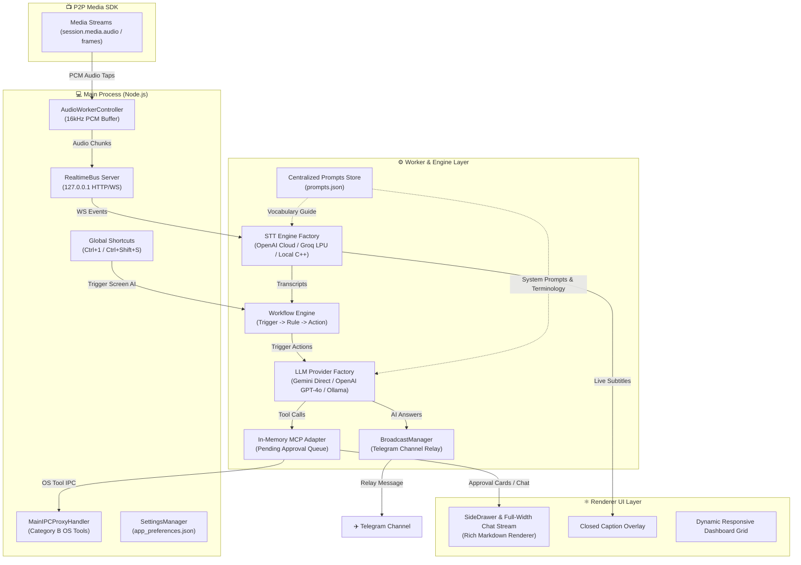

# 📺 Synapse P2P Media SDK & Live AI Interview Copilot Platform `v1.0.0`

A production-grade, frameless **Electron P2P Screen Sharing Application, Media SDK & Live AI Interview Copilot Platform** built with **TypeScript**, **React 18**, and **Zustand**. Features end-to-end encrypted WebRTC audio and video streaming, modular Speech-to-Text engines (OpenAI Whisper Cloud, Groq LPU Whisper, Local C++ Whisper), decoupled LLM engines (Google Gemini Direct, OpenAI GPT-4o, Ollama, Antigravity), system-wide hotkey shortcuts (`Ctrl+1`, `Ctrl+Shift+S`), active coding language auto-detection, fast-paced interview bullet-point formatting, Telegram AI channel broadcasting, centralized JSON prompt management, multi-turn conversation memory, Model Context Protocol (MCP) tool integration, token-optimized context scoping, rich Markdown chat rendering, and a dynamic responsive UI layout.

---

## 🌟 Key Features & Architectural Highlights

### ⌨️ Instant Keyboard Hotkeys & Active Coding Language Detection
* **🎯 Dedicated Quiz & Coding Shortcut (`Ctrl + 1` / `Cmd + 1`)**:
  * Works **system-wide** (even when the application is in the background or minimized).
  * Captures active screen screenshot at 960×540 JPEG and analyzes the question instantly.
  * **Quiz Mode**: Outputs the correct option clearly first, followed by a brief 1-2 sentence explanation.
  * **Coding Mode**: Outputs the minimal working solution with surgical comments.
* **📸 General Coding & Surgical Debug Shortcut (`Ctrl + Shift + S` / `Cmd + Shift + S`)**:
  * Captures active screen context and provides 1-3 line surgical bug fixes or clean algorithms.
* **🌐 Active Programming Language Auto-Detection**:
  * Automatically reads the active language selected in the editor header (e.g. `JavaScript`, `Node.js`, `Python3`, `C++`, `Java`, `TypeScript`) or template code signature, and writes the solution strictly in that detected language.

---

### ⚡ Fast-Paced Interview Bullet-Point Formatting
* **🚫 Zero Dense Paragraphs**:
  * Eliminates walls of text that are impossible to read under interview time pressure.
* **🎯 Bold Lead-In Keywords for 2-Second Visual Scanning**:
  * Starts every bullet point with a bold category lead-in (`**Core Concept**:`, `**Time Complexity**:`, `**Space Complexity**:`, `**Key Trade-off**:`).
* **💬 Surgical Code Comments**:
  * Inline comments explain *why* logic was chosen (`// lookup complement in O(1)`), allowing candidates to speak naturally while typing.

---

### 🤖 Modular AI Engine & Provider Registries (`ILLMProvider` & `ITranscriptionProvider`)
* **🧩 Modular LLM Provider Factory (`LLMProviderFactory.ts`)**:
  * **Google Gemini Direct API (Fast Path)**: Sub-500ms response time using `gemini-flash-lite-latest` and `gemini-3.5-flash` with direct REST endpoints.
  * **OpenAI GPT-4o / GPT-4o-mini**: OpenAI Chat Completions REST provider with multimodal vision (`image_url`) support.
  * **Local Ollama LLM**: Offline local inference via `http://127.0.0.1:11434` (`llama3.2`, `mistral`).
  * **Antigravity Copilot Provider**: Integrated agentic assistant mode.
  * **Zero-Code `.env` Switching**: Switch LLM providers seamlessly by changing `LLM_PROVIDER=openai` or `LLM_PROVIDER=gemini` in `.env`.
* **🎙️ Modular Speech-to-Text Engine (`TranscriptionProviderFactory.ts`)**:
  * **OpenAI Cloud Whisper API**: High-accuracy cloud STT with technical domain prompt guiding.
  * **Groq LPU Cloud Whisper (`whisper-large-v3`)**: Sub-100ms ultra-fast LPU hardware accelerated STT (`https://api.groq.com/openai/v1`).
  * **Local Offline C++ Whisper**: Native `whisper-cli.exe` C++ binary running `ggml-tiny.en.bin` for 100% offline, privacy-first transcription.

---

### 📡 Modular Broadcaster Framework & Telegram Relay
* **🔌 Fan-Out Observer Pattern (`IBroadcastProvider` & `BroadcastManager`)**:
  * Extensible broadcast architecture allowing real-time AI answers to be fan-out relayed to external communication channels.
* **✈️ Telegram Bot API Provider (`TelegramBroadcastProvider.ts`)**:
  * Real-time HTML-formatted broadcast of AI responses to designated Telegram channels or chat groups.
  * Configurable under **Settings Panel -> Connectors & Integrations** with live test button.

---

### 🧠 Centralized Prompt Management & Multi-Turn Conversation Memory
* **📋 Centralized Prompt Store (`prompts.json`)**:
  * Single point of truth for all system prompts (`intentClassifier`, `technicalAssistant`) and STT terminology guides (`technicalVocabularyGuide`).
  * Enriched dictionary covering AI/LLM/RAG, Python, Node.js, React.js, and CS core topics.
* **💬 Multi-Turn Conversation Memory (Up to 10 Q&A Turns)**:
  * Stateful 20-message (10 Q&A turns) conversation window allowing natural follow-up questions (*"How does it scale?"*, *"Compare it to Memcached"*).
  * Automatically resets when the user clicks **"Clear Log"**.
* **⚡ Token & Memory Optimization**:
  * Past turns store clean text Q&A pairs only. Heavy base64 images and raw clipboard dumps are omitted from past history turns.

---

### 🎙️ Advanced VAD & Diagnostic Metrics
* **📊 Live VAD Metrics**:
  * Tracks and logs `Peak RMS`, `Trigger RMS`, `NoiseFloor`, and `Dynamic Threshold` on every speech event.
* **🛡️ Enhanced Noise Immunity**:
  * Dynamic threshold set to `Math.max(300, NoiseFloor * 2.2)` to eliminate room fan noise, keyboard clicks, and breath intake triggers.

---

### 🎨 Rich Markdown Chat UI & Dynamic Screen Layout
* **💻 Custom React Markdown Renderer**: Renders AI answers with syntax-styled code containers, inline code pills (`code`), bold titles, and bullet lists.
* **📐 Dynamic Top Full-Width Screen Spreading**:
  * **Active AI Mode**: Chat UI automatically expands to **100% full screen width** at the top (`max-width: 1100px`), giving maximum room for code blocks and technical responses.
  * **Stopped AI Mode**: Reverts back to compact sidebar layout.

---

### 📺 P2P Media & WebRTC SDK
* **⚛️ React 18 + Zustand Architecture**: Powered by React 18 and centralized Zustand (`useAppStore`) state management.
* **🔑 8-Character Base36 Session Codes**: High-entropy session codes (`a7k9-x2p4`) with **2.82 Trillion combinations ($36^8$)**.
* **🔒 End-to-End Encrypted (E2EE) WebRTC**: High-framerate video and audio streamed directly peer-to-peer (DTLS-SRTP).
* **🎛️ Dynamic Signaling Provider & Auto Cascade**:
  * ⚡ **Auto Priority Cascade** (Firebase > WebSockets > WebTorrents > Electron IPC > Memory).

---

## 🏗️ System Architecture Diagram



---

## 🚀 Quick Start Guide

### 1. Installation
```bash
git clone https://github.com/Sumitkumar193/Synapse_P2P.git
cd Synapse_P2P
npm install
```

### 2. Environment Configuration (`.env`)
Create a `.env` file in the project root:
```env
# AI LLM Provider Selection: "openai", "gemini", "ollama", or "antigravity"
LLM_PROVIDER=openai
OPENAI_API_KEY=sk-proj-...

# Speech-to-Text Provider Selection: "openai", "groq", or "local"
WHISPER_PROVIDER=openai
OPENAI_STT_MODEL=whisper-1

# Optional: Telegram Channel AI Relay Broadcast
ENABLE_TELEGRAM_RELAY=true
TELEGRAM_BOT_TOKEN=your-telegram-bot-token
TELEGRAM_CHAT_ID=-1001234567890
```

### 3. Build & Run
```bash
# Build TypeScript and bundle dist via esbuild
npm run build

# Start Electron application
npm start
```

---

## 📄 License
MIT License. Built for high-performance P2P screen sharing and live AI technical interview assistance.
